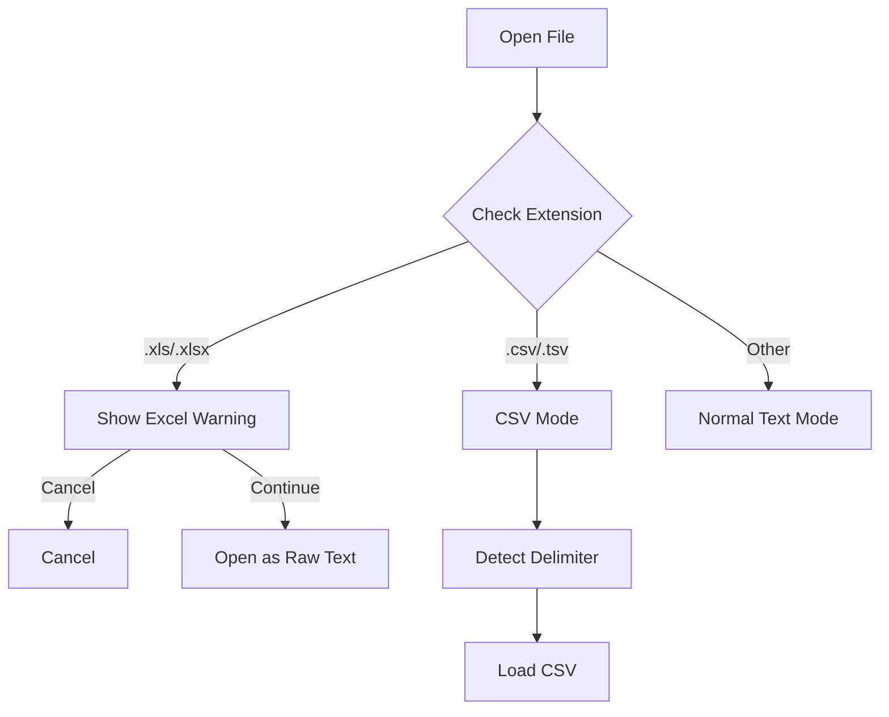

# Design Document: CSV Support & Excel Warning

## Overview

Dokumen ini menjelaskan desain untuk dukungan file CSV dan peringatan untuk file Excel di XNote.

## Architecture

### File Type Detection Flow



## Components

### 1. Excel File Detection

```c
/* Check if file is Excel format */
static BOOL IsExcelFile(const TCHAR* szFilePath);

/* Show warning dialog for Excel files */
static BOOL ShowExcelWarning(HWND hwnd, const TCHAR* szFileName);
```

### 2. CSV File Detection

```c
/* Check if file is CSV format */
static BOOL IsCSVFile(const TCHAR* szFilePath);
```

## Implementation Status

- [x] Excel file detection (IsExcelFile)
- [x] Excel warning dialog (ShowExcelWarning)
- [x] CSV file detection (IsCSVFile)
- [ ] CSV delimiter auto-detection
- [ ] CSV column alignment display

## Correctness Properties

### Property 1: Excel Warning Display
*For any* file with .xls or .xlsx extension, the system SHALL display a warning dialog before opening.

**Validates: Requirements 2.1, 2.2**

### Property 2: CSV Detection
*For any* file with .csv or .tsv extension, the system SHALL detect it as a CSV file.

**Validates: Requirements 1.1**

