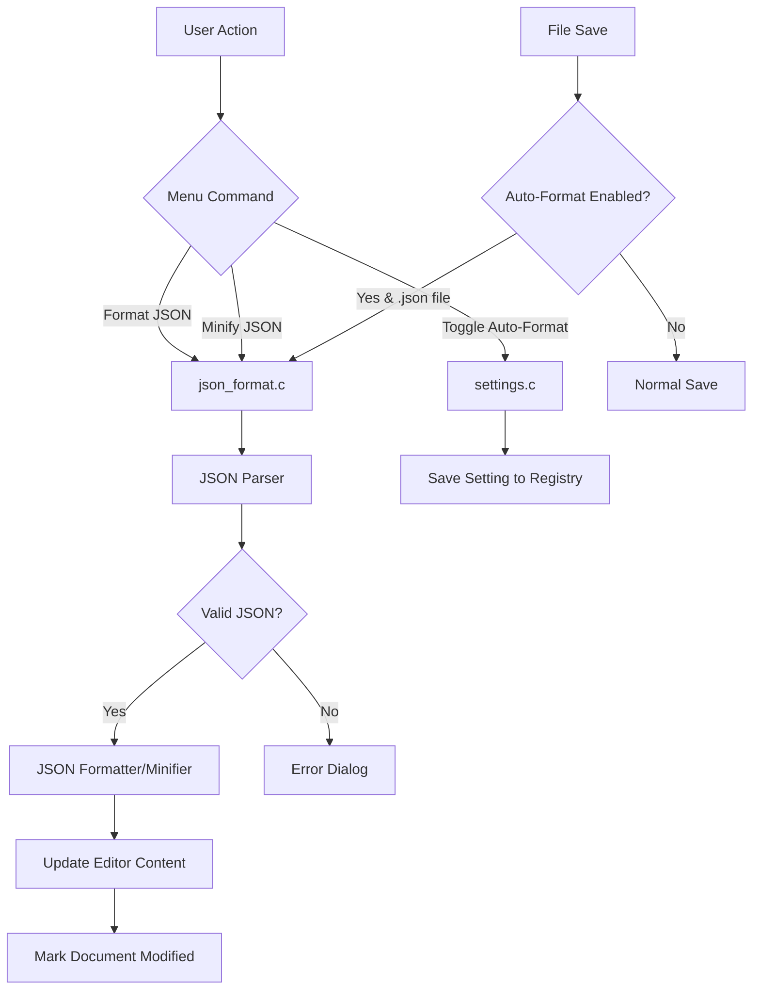

# Design Document: JSON Formatter

## Overview

Fitur JSON Formatter untuk XNote menyediakan kemampuan untuk memformat (pretty print) dan minify dokumen JSON. Implementasi menggunakan parser JSON sederhana yang dibangun dari scratch dalam C, tanpa dependensi eksternal. Fitur ini terintegrasi dengan menu Edit dan sistem settings yang sudah ada.

## Architecture



## Components and Interfaces

### 1. JSON Parser Module (json_format.h / json_format.c)

```c
/* JSON value types */
typedef enum {
    JSON_NULL,
    JSON_BOOL,
    JSON_NUMBER,
    JSON_STRING,
    JSON_ARRAY,
    JSON_OBJECT
} JsonValueType;

/* JSON value structure */
typedef struct JsonValue {
    JsonValueType type;
    union {
        BOOL boolValue;
        double numberValue;
        WCHAR* stringValue;
        struct {
            struct JsonValue** items;
            int count;
            int capacity;
        } array;
        struct {
            WCHAR** keys;
            struct JsonValue** values;
            int count;
            int capacity;
        } object;
    } data;
} JsonValue;

/* Parse result */
typedef struct {
    BOOL success;
    JsonValue* root;
    int errorLine;
    int errorColumn;
    WCHAR errorMessage[256];
} JsonParseResult;

/* Public API */
JsonParseResult* JsonParse(const WCHAR* input);
WCHAR* JsonFormat(JsonValue* value, int indentSpaces);
WCHAR* JsonMinify(JsonValue* value);
void JsonFreeValue(JsonValue* value);
void JsonFreeParseResult(JsonParseResult* result);

/* Pretty printer for round-trip testing */
WCHAR* JsonPrettyPrint(const WCHAR* input, int indentSpaces, BOOL* success, WCHAR* errorMsg, int errorMsgSize);
WCHAR* JsonMinifyString(const WCHAR* input, BOOL* success, WCHAR* errorMsg, int errorMsgSize);
```

### 2. Menu Integration (resource.h additions)

```c
#define IDM_FORMAT_JSON     450
#define IDM_MINIFY_JSON     451
#define IDM_AUTO_FORMAT_JSON 452
```

### 3. Settings Integration (settings.c additions)

```c
/* JSON formatter settings */
BOOL g_bAutoFormatJson;  /* Auto-format JSON on save */

void LoadJsonFormatterSettings(void);
void SaveJsonFormatterSettings(void);
BOOL IsAutoFormatJsonEnabled(void);
void SetAutoFormatJson(BOOL bEnabled);
```

### 4. File Operations Integration (file_ops.c modifications)

Modifikasi fungsi `FileSave` untuk memeriksa apakah auto-format diaktifkan dan file adalah JSON.

## Data Models

### JsonValue Structure

```
JsonValue
├── type: JsonValueType
└── data: union
    ├── boolValue: BOOL (for JSON_BOOL)
    ├── numberValue: double (for JSON_NUMBER)
    ├── stringValue: WCHAR* (for JSON_STRING)
    ├── array: struct (for JSON_ARRAY)
    │   ├── items: JsonValue**
    │   ├── count: int
    │   └── capacity: int
    └── object: struct (for JSON_OBJECT)
        ├── keys: WCHAR**
        ├── values: JsonValue**
        ├── count: int
        └── capacity: int
```

### Settings Storage

Setting disimpan di Windows Registry:
- Key: `HKEY_CURRENT_USER\Software\XNote\Settings`
- Value: `AutoFormatJson` (DWORD, 0 = disabled, 1 = enabled)


## Correctness Properties

*A property is a characteristic or behavior that should hold true across all valid executions of a system-essentially, a formal statement about what the system should do. Properties serve as the bridge between human-readable specifications and machine-verifiable correctness guarantees.*

### Property 1: Round-trip consistency

*For any* valid JSON value (including objects, arrays, strings with Unicode/escape characters, numbers, booleans, and null), parsing then formatting (or minifying) then parsing again should produce an equivalent data structure.

**Validates: Requirements 1.3, 3.3, 4.1, 4.2, 4.3**

### Property 2: Indentation correctness

*For any* valid JSON with nested structures, the formatted output should have exactly `depth * 4` spaces of indentation for each line, where depth is the nesting level of the element on that line.

**Validates: Requirements 1.1, 4.4**

### Property 3: Invalid JSON error detection

*For any* malformed JSON string (missing quotes, unbalanced brackets, invalid escape sequences, etc.), the parser should return an error result with success=FALSE and meaningful error information.

**Validates: Requirements 1.2**

### Property 4: Minify removes all unnecessary whitespace

*For any* valid JSON, the minified output should contain no whitespace characters outside of string values, and the length of minified output should be less than or equal to the formatted output.

**Validates: Requirements 3.1**

## Error Handling

### Parse Errors

| Error Type | Error Message | Recovery |
|------------|---------------|----------|
| Unexpected character | "Unexpected character 'X' at line Y, column Z" | Show error dialog, no changes to document |
| Unterminated string | "Unterminated string at line Y, column Z" | Show error dialog, no changes to document |
| Invalid escape sequence | "Invalid escape sequence at line Y, column Z" | Show error dialog, no changes to document |
| Unexpected end of input | "Unexpected end of input" | Show error dialog, no changes to document |
| Invalid number format | "Invalid number format at line Y, column Z" | Show error dialog, no changes to document |

### Memory Errors

| Error Type | Error Message | Recovery |
|------------|---------------|----------|
| Allocation failure | "Out of memory" | Show error dialog, free partial allocations |

## Testing Strategy

### Unit Tests

Unit tests akan mencakup:
- Parsing JSON primitives (null, true, false, numbers, strings)
- Parsing arrays dan objects
- Formatting dengan berbagai level nesting
- Minifying JSON
- Error handling untuk invalid JSON

### Property-Based Tests

Property-based testing menggunakan custom generator untuk menghasilkan random JSON values. Karena ini adalah aplikasi C Windows, kita akan menggunakan pendekatan sederhana dengan random seed dan custom generators.

**Test Framework**: Custom C-based property testing dengan random generators

**Minimum iterations**: 100 per property

**Generators needed**:
- `gen_json_value()`: Generate random JSON value (recursive)
- `gen_json_string()`: Generate random string with Unicode and escape chars
- `gen_json_number()`: Generate random valid JSON numbers
- `gen_invalid_json()`: Generate malformed JSON strings

**Property tests to implement**:
1. Round-trip test: `parse(format(parse(json))) == parse(json)`
2. Indentation test: Verify indentation matches nesting depth
3. Error detection test: Invalid JSON always returns error
4. Minify test: No whitespace outside strings, length <= formatted length

Setiap property test harus di-tag dengan format:
`/* **Feature: json-formatter, Property N: property_text** */`
