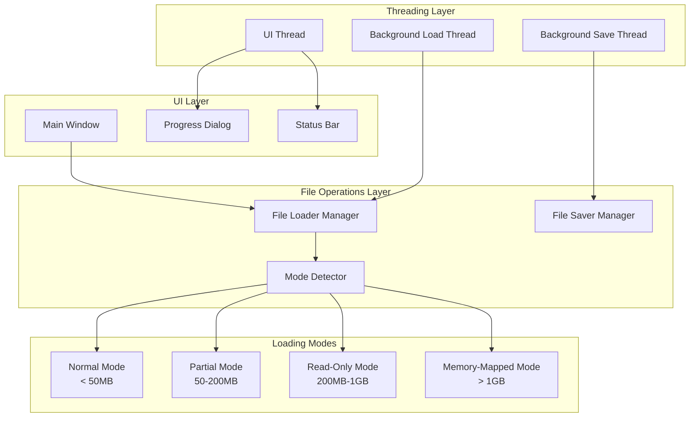
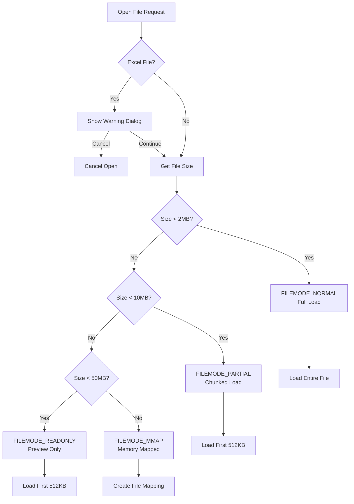

# Design Document: Large File Performance Optimization

## Overview

Dokumen ini menjelaskan desain teknis untuk optimasi performa XNote dalam menangani file besar (>500MB). Implementasi menggunakan pendekatan multi-mode loading yang secara otomatis memilih strategi terbaik berdasarkan ukuran file, mirip dengan editor modern seperti VS Code dan Sublime Text.

### Tujuan Utama
1. Membuka file hingga 1GB+ tanpa "not responding"
2. Menjaga UI tetap responsif selama operasi file
3. Mengoptimalkan penggunaan memori untuk file besar
4. Memberikan feedback visual yang jelas kepada pengguna

## Architecture

### High-Level Architecture



### Mode Selection Flow



## Components and Interfaces

### 1. File Mode Detector

```c
/* File loading modes - already defined in notepad.h */
typedef enum {
    FILEMODE_NORMAL = 0,    /* < 2MB: Full load */
    FILEMODE_PARTIAL,       /* 2-10MB: Chunked loading */
    FILEMODE_READONLY,      /* 10-50MB: Read-only preview */
    FILEMODE_MMAP           /* > 50MB: Memory-mapped */
} FileModeType;

/* Mode detection function */
FileModeType DetectOptimalFileMode(DWORD dwFileSize);

/* Mode thresholds (OPTIMIZED for responsiveness) */
#define THRESHOLD_PROGRESS      (1 * 1024 * 1024)   /* 1MB - show progress */
#define THRESHOLD_PARTIAL       (2 * 1024 * 1024)   /* 2MB */
#define THRESHOLD_READONLY      (10 * 1024 * 1024)  /* 10MB */
#define THRESHOLD_MMAP          (50 * 1024 * 1024)  /* 50MB */

/* Scroll optimization thresholds */
#define LINE_COUNT_DEBOUNCE_THRESHOLD  5000   /* Enable debouncing for files with >5000 lines */
#define LINE_COUNT_SIMPLIFIED_RENDER   10000  /* Use simplified line number rendering */
#define LINE_COUNT_DISABLE_LINENUMS    100000 /* Disable line numbers entirely */
#define THRESHOLD_SYNTAX_OFF    (256 * 1024)        /* 256KB - disable syntax */
#define THRESHOLD_LINE_SYNTAX   5000                /* 5000 lines - disable syntax */
```

### 2. Background Thread Loader

```c
/* Thread data structure for file loading */
typedef struct {
    TCHAR szFileName[MAX_PATH];
    HWND hEdit;
    HWND hwndProgress;
    HWND hwndMain;
    
    /* File data */
    WCHAR* pWideText;
    DWORD dwWideLen;
    LineEndingType lineEnding;
    
    /* Progress tracking */
    volatile DWORD dwFileSize;
    volatile DWORD dwBytesRead;
    volatile DWORD dwProgress;      /* 0-100 */
    volatile BOOL bCancelled;
    volatile BOOL bError;
    volatile BOOL bCompleted;
    
    TCHAR szError[256];
} FILELOAD_THREAD_DATA;

/* Thread functions */
DWORD WINAPI FileLoadThreadProc(LPVOID lpParam);
DWORD WINAPI FileSaveThreadProc(LPVOID lpParam);
```

### 3. Progress Dialog Interface

```c
/* Progress dialog resource IDs */
#define IDD_PROGRESS        201
#define IDC_PROGRESS_BAR    1001
#define IDC_PROGRESS_TEXT   1002
#define IDC_PROGRESS_CANCEL 1003

/* Progress dialog procedure */
INT_PTR CALLBACK ProgressDlgProc(HWND hDlg, UINT msg, WPARAM wParam, LPARAM lParam);

/* Progress update functions */
void UpdateProgressBar(HWND hwndProgress, DWORD dwProgress);
void UpdateProgressText(HWND hwndProgress, DWORD dwLoaded, DWORD dwTotal);
```

### 4. Memory-Mapped File Handler

```c
/* Memory-mapped file structure */
typedef struct {
    HANDLE hFile;           /* File handle */
    HANDLE hMapping;        /* File mapping handle */
    LPVOID pBaseView;       /* Base view pointer */
    DWORD dwFileSize;       /* Total file size */
    DWORD dwViewSize;       /* Current view size */
    DWORD dwViewOffset;     /* Current view offset */
} MMAP_FILE;

/* Memory-mapped functions */
BOOL MMapOpenFile(MMAP_FILE* pMMap, const TCHAR* szFileName);
BOOL MMapReadView(MMAP_FILE* pMMap, DWORD dwOffset, DWORD dwSize, LPVOID* ppData);
void MMapCloseFile(MMAP_FILE* pMMap);
```

### 5. Chunked Loading Manager

```c
/* Chunk loading functions */
BOOL LoadFileChunked(HWND hEdit, const TCHAR* szFileName, 
                     DWORD dwChunkSize, DWORD* pdwLoaded);
BOOL LoadMoreContent(HWND hwnd);
BOOL AppendChunkToEdit(HWND hEdit, const WCHAR* pText, DWORD dwLen);

/* Chunk size constants (OPTIMIZED for instant display) */
#define INITIAL_CHUNK_SIZE  (512 * 1024)        /* 512KB initial - instant display */
#define LOAD_MORE_CHUNK     (1 * 1024 * 1024)   /* 1MB per F5 */
#define PREVIEW_SIZE        (512 * 1024)        /* 512KB preview */
#define THREAD_CHUNK_SIZE   (32 * 1024)         /* 32KB read chunks */
#define STREAM_CHUNK_SIZE   (16 * 1024)         /* 16KB for RichEdit streaming */
```

### 6. Chunked Saving Manager

```c
/* Chunked save structure */
typedef struct {
    TCHAR szFileName[MAX_PATH];
    TCHAR szTempFileName[MAX_PATH];
    HWND hEdit;
    HWND hwndProgress;
    
    volatile DWORD dwTotalSize;
    volatile DWORD dwBytesWritten;
    volatile DWORD dwProgress;
    volatile BOOL bCancelled;
    volatile BOOL bError;
    volatile BOOL bCompleted;
    
    TCHAR szError[256];
} FILESAVE_THREAD_DATA;

/* Save functions */
BOOL WriteFileChunked(const TCHAR* szFileName, HWND hEdit);
DWORD WINAPI FileSaveThreadProc(LPVOID lpParam);
```

## Data Models

### TabState Extension

```c
/* Extended TabState for large file support (already in notepad.h) */
typedef struct {
    /* ... existing fields ... */
    
    /* Large file support */
    FileModeType fileMode;       /* Current file loading mode */
    HANDLE hFileMapping;         /* Memory-mapped file handle */
    LPVOID pMappedView;          /* Mapped view pointer */
    DWORD dwTotalFileSize;       /* Total file size on disk */
    DWORD dwLoadedSize;          /* Amount currently loaded */
    DWORD dwChunkSize;           /* Chunk size for partial loading */
} TabState;
```

### Progress State

```c
/* Progress tracking state */
typedef struct {
    DWORD dwStartTime;           /* Operation start time */
    DWORD dwBytesProcessed;      /* Bytes processed so far */
    DWORD dwTotalBytes;          /* Total bytes to process */
    DWORD dwLastUpdateTime;      /* Last UI update time */
    BOOL bShowDialog;            /* Whether to show progress dialog */
} ProgressState;
```

## Correctness Properties

*A property is a characteristic or behavior that should hold true across all valid executions of a system-essentially, a formal statement about what the system should do. Properties serve as the bridge between human-readable specifications and machine-verifiable correctness guarantees.*

Based on the prework analysis, the following correctness properties have been identified:

### Property 1: File Mode Selection Correctness
*For any* file with a given size, the DetectOptimalFileMode function SHALL return:
- FILEMODE_NORMAL if size < 50MB
- FILEMODE_PARTIAL if 50MB <= size < 200MB
- FILEMODE_READONLY if 200MB <= size < 1GB
- FILEMODE_MMAP if size >= 1GB

**Validates: Requirements 1.1, 1.2, 1.3**

### Property 2: Progress Tracking Invariants
*For any* file loading or saving operation, the following invariants SHALL hold:
- 0 <= dwProgress <= 100
- dwBytesRead <= dwFileSize
- dwBytesWritten <= dwTotalSize

**Validates: Requirements 2.1, 2.2**

### Property 3: Partial Loading State Consistency
*For any* file in FILEMODE_PARTIAL mode:
- dwLoadedSize <= dwTotalFileSize
- After LoadMoreContent(), new_dwLoadedSize = min(old_dwLoadedSize + dwChunkSize, dwTotalFileSize)
- Status bar displays "Loaded X MB of Y MB" where X = dwLoadedSize and Y = dwTotalFileSize

**Validates: Requirements 3.1, 3.2**

### Property 4: Memory-Mapped View Bounds
*For any* file in FILEMODE_MMAP mode:
- dwViewOffset + dwViewSize <= dwFileSize
- Only the visible portion is mapped to memory
- Total memory usage is bounded by view size, not file size

**Validates: Requirements 4.2**

### Property 5: Large File Feature Restrictions
*For any* file with size > 1MB:
- Syntax highlighting SHALL be disabled (language = LANG_NONE for display)
- For files in FILEMODE_READONLY: undo buffer SHALL be disabled
- For files in FILEMODE_PARTIAL or FILEMODE_NORMAL with size > 50MB: undo buffer limited to 100 operations

**Validates: Requirements 5.1, 7.1, 7.2**

### Property 6: Mode Indicator Display
*For any* file in non-NORMAL mode:
- FILEMODE_READONLY: Title bar contains "READ-ONLY"
- FILEMODE_PARTIAL: Status bar contains "Load More" or "F5"
- FILEMODE_MMAP: Title bar contains "READ-ONLY" and status shows memory-mapped indicator

**Validates: Requirements 8.2, 8.3**

### Property 7: Save Operation File Preservation
*For any* save operation that fails:
- The original file SHALL remain unchanged
- A temporary file is used during save
- Only on successful completion is the original replaced

**Validates: Requirements 6.3**

## Error Handling

### Error Categories

1. **File Access Errors**
   - File not found
   - Access denied
   - File locked by another process

2. **Memory Errors**
   - Out of memory during allocation
   - Memory mapping failure
   - Buffer overflow prevention

3. **Conversion Errors**
   - Invalid UTF-8 encoding
   - Character conversion failure

4. **Operation Errors**
   - User cancellation
   - Timeout during operation
   - Disk full during save

### Error Handling Strategy

```c
/* Error codes */
typedef enum {
    FILEERR_SUCCESS = 0,
    FILEERR_NOT_FOUND,
    FILEERR_ACCESS_DENIED,
    FILEERR_OUT_OF_MEMORY,
    FILEERR_MAPPING_FAILED,
    FILEERR_CONVERSION_FAILED,
    FILEERR_USER_CANCELLED,
    FILEERR_DISK_FULL,
    FILEERR_UNKNOWN
} FileErrorCode;

/* Error handling function */
void HandleFileError(HWND hwnd, FileErrorCode errCode, const TCHAR* szFileName);
```

### Recovery Strategies

| Error Type | Recovery Action |
|------------|-----------------|
| Out of Memory | Suggest lower mode (e.g., READONLY instead of PARTIAL) |
| Mapping Failed | Fall back to chunked loading |
| Conversion Failed | Try alternative encoding (CP_ACP) |
| Disk Full | Keep original file, notify user |

## Testing Strategy

### Dual Testing Approach

Testing akan menggunakan kombinasi unit tests dan property-based tests untuk memastikan correctness:

1. **Unit Tests**: Memverifikasi contoh spesifik dan edge cases
2. **Property-Based Tests**: Memverifikasi properti universal yang harus berlaku untuk semua input

### Property-Based Testing Framework

Untuk C/Win32, kita akan menggunakan **theft** library (https://github.com/silentbicycle/theft) sebagai PBT framework karena:
- Native C support
- Lightweight dan mudah diintegrasikan
- Mendukung shrinking untuk menemukan minimal failing case

Konfigurasi: Setiap property test akan dijalankan minimal **100 iterasi**.

### Test Categories

#### 1. Mode Detection Tests (Property-Based)
```c
/* Property test: Mode selection based on file size */
/* **Feature: large-file-performance, Property 1: File Mode Selection Correctness** */
static enum theft_trial_res prop_mode_selection(struct theft* t, void* arg) {
    DWORD dwFileSize = *(DWORD*)arg;
    FileModeType mode = DetectOptimalFileMode(dwFileSize);
    
    if (dwFileSize < THRESHOLD_PARTIAL) {
        return mode == FILEMODE_NORMAL ? THEFT_TRIAL_PASS : THEFT_TRIAL_FAIL;
    } else if (dwFileSize < THRESHOLD_READONLY) {
        return mode == FILEMODE_PARTIAL ? THEFT_TRIAL_PASS : THEFT_TRIAL_FAIL;
    } else if (dwFileSize < THRESHOLD_MMAP) {
        return mode == FILEMODE_READONLY ? THEFT_TRIAL_PASS : THEFT_TRIAL_FAIL;
    } else {
        return mode == FILEMODE_MMAP ? THEFT_TRIAL_PASS : THEFT_TRIAL_FAIL;
    }
}
```

#### 2. Progress Tracking Tests (Property-Based)
```c
/* Property test: Progress values always in valid range */
/* **Feature: large-file-performance, Property 2: Progress Tracking Invariants** */
static enum theft_trial_res prop_progress_bounds(struct theft* t, void* arg) {
    ProgressState* pState = (ProgressState*)arg;
    
    DWORD dwProgress = CalculateProgress(pState->dwBytesProcessed, pState->dwTotalBytes);
    
    if (dwProgress > 100) return THEFT_TRIAL_FAIL;
    if (pState->dwBytesProcessed > pState->dwTotalBytes) return THEFT_TRIAL_FAIL;
    
    return THEFT_TRIAL_PASS;
}
```

#### 3. Chunked Loading Tests (Property-Based)
```c
/* Property test: LoadMore increases loaded size correctly */
/* **Feature: large-file-performance, Property 3: Partial Loading State Consistency** */
static enum theft_trial_res prop_load_more_increment(struct theft* t, void* arg) {
    ChunkLoadState* pState = (ChunkLoadState*)arg;
    
    DWORD dwOldLoaded = pState->dwLoadedSize;
    DWORD dwExpected = min(dwOldLoaded + pState->dwChunkSize, pState->dwTotalFileSize);
    
    // Simulate LoadMoreContent
    DWORD dwNewLoaded = SimulateLoadMore(pState);
    
    return dwNewLoaded == dwExpected ? THEFT_TRIAL_PASS : THEFT_TRIAL_FAIL;
}
```

#### 4. Unit Tests

```c
/* Unit test: Specific file size thresholds */
void test_mode_detection_thresholds(void) {
    // Boundary tests
    assert(DetectOptimalFileMode(49 * 1024 * 1024) == FILEMODE_NORMAL);
    assert(DetectOptimalFileMode(50 * 1024 * 1024) == FILEMODE_PARTIAL);
    assert(DetectOptimalFileMode(199 * 1024 * 1024) == FILEMODE_PARTIAL);
    assert(DetectOptimalFileMode(200 * 1024 * 1024) == FILEMODE_READONLY);
    assert(DetectOptimalFileMode(1023 * 1024 * 1024) == FILEMODE_READONLY);
    assert(DetectOptimalFileMode(1024 * 1024 * 1024) == FILEMODE_MMAP);
}

/* Unit test: Progress dialog cancellation */
void test_progress_cancellation(void) {
    FILELOAD_THREAD_DATA data = {0};
    data.bCancelled = TRUE;
    // Verify thread exits cleanly
}

/* Unit test: Error message display */
void test_error_messages(void) {
    // Verify each error code produces appropriate message
}
```

### Test File Generation

Untuk testing, kita perlu generate test files dengan berbagai ukuran:

```c
/* Test file generator */
BOOL CreateTestFile(const TCHAR* szPath, DWORD dwSize) {
    HANDLE hFile = CreateFile(szPath, GENERIC_WRITE, 0, NULL,
                              CREATE_ALWAYS, FILE_ATTRIBUTE_NORMAL, NULL);
    if (hFile == INVALID_HANDLE_VALUE) return FALSE;
    
    // Write pattern data in chunks
    char buffer[64 * 1024]; // 64KB buffer
    memset(buffer, 'A', sizeof(buffer));
    
    DWORD dwWritten = 0;
    while (dwWritten < dwSize) {
        DWORD dwToWrite = min(sizeof(buffer), dwSize - dwWritten);
        DWORD dwActual;
        WriteFile(hFile, buffer, dwToWrite, &dwActual, NULL);
        dwWritten += dwActual;
    }
    
    CloseHandle(hFile);
    return TRUE;
}
```

### Test Annotation Format

Setiap property-based test HARUS di-tag dengan format:
```
**Feature: large-file-performance, Property {number}: {property_text}**
```

Contoh:
```c
/* **Feature: large-file-performance, Property 1: File Mode Selection Correctness** */
```
