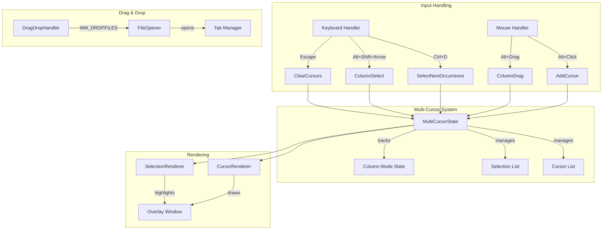

# Design Document: Multi-Cursor Editing dan Drag & Drop

## Overview

Fitur ini menambahkan kemampuan multi-cursor editing dan drag & drop file opening ke XNote text editor. Multi-cursor memungkinkan pengguna mengedit beberapa lokasi secara bersamaan, sementara drag & drop mempermudah pembukaan file.

Karena XNote menggunakan RichEdit control yang tidak memiliki native multi-cursor support, implementasi akan menggunakan custom overlay rendering dan state management untuk mensimulasikan multi-cursor behavior.

## Architecture



## Components and Interfaces

### 1. MultiCursorState Structure

```c
/* Maximum number of cursors supported */
#define MAX_CURSORS 100

/* Cursor position structure */
typedef struct {
    DWORD dwPosition;      /* Character position in document */
    DWORD dwSelStart;      /* Selection start (same as position if no selection) */
    DWORD dwSelEnd;        /* Selection end */
    BOOL bHasSelection;    /* Whether this cursor has a selection */
} CursorInfo;

/* Multi-cursor state structure */
typedef struct {
    CursorInfo cursors[MAX_CURSORS];  /* Array of cursor positions */
    int nCursorCount;                  /* Number of active cursors */
    int nPrimaryCursor;                /* Index of primary cursor */
    BOOL bColumnMode;                  /* Column selection mode active */
    int nColumnStartCol;               /* Column mode start column */
    int nColumnEndCol;                 /* Column mode end column */
    int nColumnStartLine;              /* Column mode start line */
    int nColumnEndLine;                /* Column mode end line */
} MultiCursorState;
```

### 2. Multi-Cursor API Functions

```c
/* Initialize multi-cursor state */
void MultiCursor_Init(MultiCursorState* pState);

/* Add a cursor at position */
BOOL MultiCursor_Add(MultiCursorState* pState, DWORD dwPosition);

/* Remove cursor at position */
BOOL MultiCursor_Remove(MultiCursorState* pState, DWORD dwPosition);

/* Clear all cursors except primary */
void MultiCursor_Clear(MultiCursorState* pState);

/* Get cursor count */
int MultiCursor_GetCount(MultiCursorState* pState);

/* Select next occurrence of current selection */
BOOL MultiCursor_SelectNextOccurrence(HWND hEdit, MultiCursorState* pState);

/* Handle typing at all cursor positions */
void MultiCursor_InsertText(HWND hEdit, MultiCursorState* pState, const TCHAR* szText);

/* Handle deletion at all cursor positions */
void MultiCursor_Delete(HWND hEdit, MultiCursorState* pState, BOOL bBackspace);

/* Move all cursors */
void MultiCursor_Move(HWND hEdit, MultiCursorState* pState, int nDirection);

/* Column selection functions */
void MultiCursor_StartColumnSelect(MultiCursorState* pState, int nLine, int nCol);
void MultiCursor_ExtendColumnSelect(MultiCursorState* pState, int nLine, int nCol);
void MultiCursor_ApplyColumnSelect(HWND hEdit, MultiCursorState* pState);
```

### 3. Drag & Drop Handler

```c
/* Enable drag & drop for window */
void DragDrop_Enable(HWND hwnd);

/* Handle WM_DROPFILES message */
void DragDrop_HandleFiles(HWND hwnd, HDROP hDrop);

/* Check if file is already open */
int DragDrop_FindOpenFile(const TCHAR* szFileName);

/* Validate file type */
BOOL DragDrop_IsValidFile(const TCHAR* szFileName);
```

### 4. Cursor Renderer

```c
/* Create overlay window for cursor rendering */
HWND CursorOverlay_Create(HWND hwndParent);

/* Update cursor overlay positions */
void CursorOverlay_Update(HWND hwndOverlay, HWND hEdit, MultiCursorState* pState);

/* Draw secondary cursors */
void CursorOverlay_Paint(HWND hwndOverlay, HDC hdc, MultiCursorState* pState);
```

## Data Models

### TabState Extension

```c
/* Extended TabState with multi-cursor support */
typedef struct {
    /* ... existing fields ... */
    
    /* Multi-cursor state for this tab */
    MultiCursorState multiCursor;
    
    /* Overlay window for cursor rendering */
    HWND hwndCursorOverlay;
} TabState;
```

### Cursor Position Calculation

Untuk menghitung posisi pixel dari cursor position:

```c
typedef struct {
    int x;          /* X coordinate in edit control */
    int y;          /* Y coordinate in edit control */
    int height;     /* Cursor height (line height) */
} CursorPixelPos;

CursorPixelPos GetCursorPixelPosition(HWND hEdit, DWORD dwCharPos);
```

## Correctness Properties

*A property is a characteristic or behavior that should hold true across all valid executions of a system-essentially, a formal statement about what the system should do. Properties serve as the bridge between human-readable specifications and machine-verifiable correctness guarantees.*

### Property 1: Select Next Occurrence Finds Correct Match
*For any* document containing N occurrences of a string S, when the first occurrence is selected and Ctrl+D is pressed, the selection list SHALL contain exactly 2 selections, both matching string S exactly.
**Validates: Requirements 1.1, 1.2**

### Property 2: Cursor Addition Increases Count
*For any* document and any valid position P not already containing a cursor, adding a cursor at P SHALL increase the cursor count by exactly 1.
**Validates: Requirements 2.1**

### Property 3: Cursor Removal at Existing Position
*For any* multi-cursor state with cursor at position P, removing the cursor at P SHALL decrease the cursor count by exactly 1.
**Validates: Requirements 2.2**

### Property 4: Multi-Cursor Typing Consistency
*For any* document with N cursors (N > 1) at positions P1...PN, typing a string S SHALL result in S being inserted at all N positions, and the document length SHALL increase by N * len(S).
**Validates: Requirements 1.5, 2.3**

### Property 5: Escape Collapses to Single Cursor
*For any* multi-cursor state with N cursors (N > 1), pressing Escape SHALL result in exactly 1 cursor remaining at the primary cursor position.
**Validates: Requirements 2.4**

### Property 6: Arrow Key Preserves Relative Positions
*For any* multi-cursor state, after moving all cursors in direction D, the relative distances between cursor positions SHALL remain unchanged (within line boundary constraints).
**Validates: Requirements 2.5**

### Property 7: Column Selection Forms Rectangle
*For any* column selection from (line1, col1) to (line2, col2), the selection SHALL span exactly |line2 - line1| + 1 lines, and each line's selection SHALL start at min(col1, col2) and end at max(col1, col2).
**Validates: Requirements 3.1, 3.2**

### Property 8: Column Typing Inserts on All Rows
*For any* column selection spanning N lines, typing string S SHALL insert S at each of the N lines at the column position.
**Validates: Requirements 3.3**

### Property 9: Cursor Count Accuracy
*For any* multi-cursor state with N cursors, the GetCursorCount function SHALL return exactly N.
**Validates: Requirements 4.3**

### Property 10: File Drop Opens Correct Tab Count
*For any* list of N valid file paths dropped onto XNote, the tab count SHALL increase by exactly N (minus any files already open).
**Validates: Requirements 5.2, 5.3**

### Property 11: Duplicate File Drop Switches Tab
*For any* file F already open in tab T, dropping F SHALL NOT increase tab count and SHALL switch to tab T.
**Validates: Requirements 5.4**

### Property 12: Multi-Cursor Undo Atomicity
*For any* multi-cursor edit operation affecting N positions, a single undo SHALL revert all N changes atomically.
**Validates: Requirements 6.1**

### Property 13: Tab Switch Preserves Multi-Cursor State
*For any* tab with multi-cursor state S, switching to another tab and back SHALL restore the exact same cursor positions.
**Validates: Requirements 6.2**

### Property 14: Find/Replace Clears Multi-Cursor
*For any* multi-cursor state, initiating find/replace SHALL result in exactly 1 cursor.
**Validates: Requirements 6.3**

## Error Handling

### Multi-Cursor Errors

| Error Condition | Handling |
|----------------|----------|
| MAX_CURSORS exceeded | Ignore new cursor addition, show status message |
| Invalid cursor position | Clamp to valid document range |
| Cursor position collision | Merge overlapping cursors |
| Column select on empty line | Pad with spaces or skip line |

### Drag & Drop Errors

| Error Condition | Handling |
|----------------|----------|
| Binary file dropped | Show warning, don't open |
| File too large | Use existing large file handling |
| File access denied | Show error message |
| Invalid file path | Show error message |

## Testing Strategy

### Property-Based Testing

Menggunakan library: **theft** (C property-based testing library) atau custom implementation dengan random generation.

Setiap property test akan:
1. Generate random document content
2. Generate random cursor positions
3. Perform operation
4. Verify property holds

### Unit Tests

1. **MultiCursor_Add**: Test adding cursors at various positions
2. **MultiCursor_Remove**: Test removing existing and non-existing cursors
3. **MultiCursor_SelectNextOccurrence**: Test with various text patterns
4. **Column selection**: Test rectangular selection calculation
5. **DragDrop_HandleFiles**: Test with single and multiple files

### Integration Tests

1. Full Ctrl+D workflow with typing
2. Alt+Click cursor addition and typing
3. Column selection and typing
4. Drag & drop file opening
5. Tab switching with multi-cursor state

### Test Annotations

Setiap property-based test HARUS di-tag dengan format:
```c
/* **Feature: multi-cursor-dragdrop, Property 1: Select Next Occurrence Finds Correct Match** */
```
