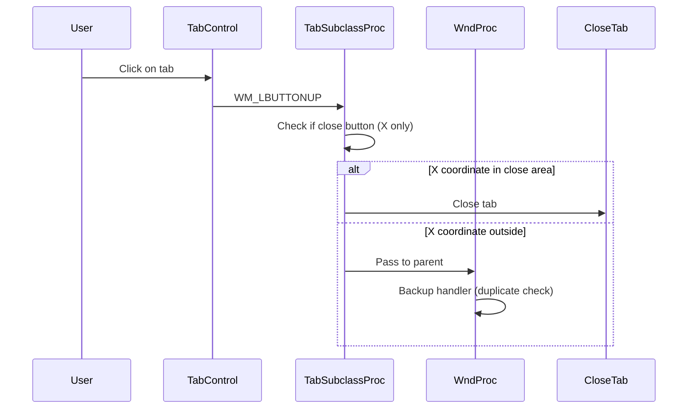
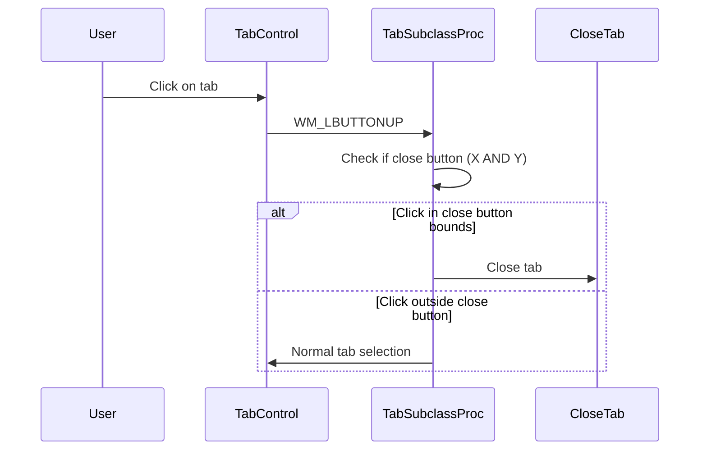

# Design Document: Tab Close Bug Fix

## Overview

Dokumen ini menjelaskan desain untuk memperbaiki bug close tab di XNote. Bug utama yang ditemukan adalah:

1. **Bug koordinat mouse**: Penggunaan `LOWORD/HIWORD` untuk koordinat mouse tidak menangani nilai signed dengan benar
2. **Bug area close button**: Pengecekan hanya pada koordinat X, tidak memeriksa batas Y dari close button
3. **Bug hover state**: State hover tidak di-reset dengan benar dalam beberapa kasus
4. **Duplikasi handler**: Ada dua handler untuk close button click (di TabSubclassProc dan WndProc) yang bisa menyebabkan konflik

## Architecture

### Current Flow (Buggy)



### Fixed Flow



## Components and Interfaces

### 1. TabSubclassProc (src/main.c)

**Bug Fix Required:**
- Gunakan `GET_X_LPARAM` dan `GET_Y_LPARAM` untuk koordinat mouse (menangani signed values)
- Tambahkan pengecekan batas Y untuk close button
- Perbaiki area deteksi close button

**Current Code (Buggy):**
```c
case WM_LBUTTONUP: {
    POINT pt = {LOWORD(lParam), HIWORD(lParam)};  // BUG: unsigned conversion
    // ...
    if (pt.x >= closeX) {  // BUG: only checks X, not Y
        CloseTab(hwndParent, nTab);
    }
}
```

**Fixed Code:**
```c
case WM_LBUTTONUP: {
    POINT pt = {GET_X_LPARAM(lParam), GET_Y_LPARAM(lParam)};  // FIX: signed
    // ...
    RECT rcClose;
    rcClose.right = rcItem.right - 4;
    rcClose.left = rcClose.right - CLOSE_BTN_SIZE;
    rcClose.top = rcItem.top + (rcItem.bottom - rcItem.top - CLOSE_BTN_SIZE) / 2;
    rcClose.bottom = rcClose.top + CLOSE_BTN_SIZE;
    
    if (PtInRect(&rcClose, pt)) {  // FIX: checks both X and Y
        CloseTab(hwndParent, nTab);
    }
}
```

### 2. WndProc Backup Handler (src/main.c)

**Bug Fix Required:**
- Hapus atau perbaiki backup handler di WM_LBUTTONUP yang duplikat
- Handler ini tidak diperlukan karena TabSubclassProc sudah menangani

### 3. Hover Detection (src/main.c)

**Bug Fix Required:**
- Gunakan `GET_X_LPARAM` dan `GET_Y_LPARAM` untuk WM_MOUSEMOVE
- Tambahkan pengecekan batas Y untuk hover detection

## Data Models

Tidak ada perubahan pada data model. Struktur yang ada sudah cukup:

```c
/* Hover tracking for close button */
static int g_nHoverTab = -1;      // Tab index yang sedang di-hover
static BOOL g_bHoverClose = FALSE; // Apakah hover di close button
static BOOL g_bTrackingMouse = FALSE; // Apakah tracking mouse leave
```

## Correctness Properties

*A property is a characteristic or behavior that should hold true across all valid executions of a system-essentially, a formal statement about what the system should do. Properties serve as the bridge between human-readable specifications and machine-verifiable correctness guarantees.*

### Property 1: Close button click detection accuracy
*For any* click position within the close button rectangle (both X and Y bounds), the click SHALL trigger tab close, and for any click position outside the close button rectangle, the click SHALL NOT trigger tab close.
**Validates: Requirements 1.1, 1.2, 1.3**

### Property 2: Tab index consistency after close
*For any* tab close operation on a multi-tab state, the remaining tabs SHALL have consecutive indices from 0 to (count-1), and the current tab index SHALL be valid (within bounds).
**Validates: Requirements 4.1, 4.3**

### Property 3: Single tab close creates new tab
*For any* close operation when only one tab exists, after the close operation completes, there SHALL be exactly one untitled tab.
**Validates: Requirements 2.3, 4.2**

## Error Handling

1. **Invalid tab index**: CloseTab sudah menangani dengan early return
2. **Null window handles**: Pengecekan NULL sebelum operasi window
3. **Memory cleanup**: Pastikan semua resource di-free saat tab ditutup

## Testing Strategy

### Unit Tests
- Test koordinat conversion dengan nilai positif dan negatif
- Test PtInRect dengan berbagai posisi click
- Test tab index setelah close operation

### Property-Based Tests
Menggunakan manual testing karena ini adalah aplikasi Win32 GUI:

1. **Property 1 Test**: Klik di berbagai posisi pada tab dan verifikasi behavior
2. **Property 2 Test**: Buka beberapa tab, tutup di berbagai posisi, verifikasi indices
3. **Property 3 Test**: Tutup semua tab sampai satu, tutup yang terakhir, verifikasi tab baru dibuat

### Integration Tests
- Test Ctrl+W shortcut
- Test close button dengan mouse
- Test close all tabs
- Test close other tabs
