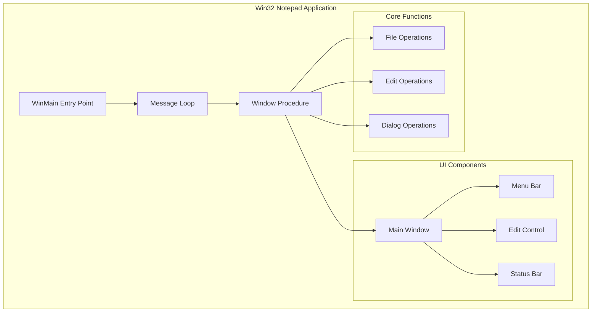
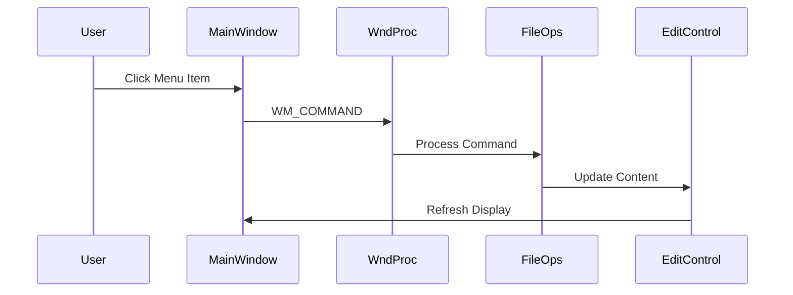

# Design Document

## Overview

Aplikasi Notepad Win32 adalah editor teks sederhana yang dibangun menggunakan bahasa C murni dengan Win32 API. Aplikasi ini menyediakan fungsionalitas dasar pengeditan teks termasuk membuat, membuka, menyimpan file, serta operasi edit standar (cut, copy, paste, undo). Desain mengutamakan kesederhanaan dan performa dengan memanfaatkan kontrol native Windows.

## Architecture

Aplikasi menggunakan arsitektur single-window dengan event-driven programming model yang merupakan standar Win32 API.



### Component Flow



## Components and Interfaces

### 1. Main Window Component

**Tanggung Jawab:**
- Membuat dan mengelola jendela utama aplikasi
- Menangani resize dan repositioning
- Mengelola child controls (Edit, Status Bar)

**Interface:**
```c
// Window class registration
ATOM RegisterMainWindowClass(HINSTANCE hInstance);

// Window creation
HWND CreateMainWindow(HINSTANCE hInstance, int nCmdShow);

// Window procedure
LRESULT CALLBACK WndProc(HWND hwnd, UINT msg, WPARAM wParam, LPARAM lParam);
```

### 2. Menu Component

**Tanggung Jawab:**
- Membuat menu bar dengan menu items
- Menangani keyboard accelerators

**Menu Structure:**
```
File
├── New         (Ctrl+N)
├── Open...     (Ctrl+O)
├── Save        (Ctrl+S)
├── Save As...
├── ─────────
└── Exit

Edit
├── Undo        (Ctrl+Z)
├── ─────────
├── Cut         (Ctrl+X)
├── Copy        (Ctrl+C)
├── Paste       (Ctrl+V)
├── ─────────
└── Select All  (Ctrl+A)

View
└── Line Numbers

Help
└── About
```

**Interface:**
```c
// Menu creation
HMENU CreateMainMenu(void);

// Accelerator table
HACCEL CreateAcceleratorTable(void);
```

### 3. File Operations Component

**Tanggung Jawab:**
- Membuat dokumen baru
- Membuka file teks
- Menyimpan file teks
- Mengelola status modified

**Interface:**
```c
// File state structure
typedef struct {
    TCHAR szFileName[MAX_PATH];
    BOOL bModified;
    BOOL bUntitled;
} FileState;

// File operations
BOOL FileNew(HWND hwnd, FileState* pState);
BOOL FileOpen(HWND hwnd, FileState* pState);
BOOL FileSave(HWND hwnd, FileState* pState);
BOOL FileSaveAs(HWND hwnd, FileState* pState);

// Helper functions
BOOL PromptSaveChanges(HWND hwnd, FileState* pState);
void UpdateWindowTitle(HWND hwnd, const FileState* pState);
```

### 4. Edit Operations Component

**Tanggung Jawab:**
- Menangani operasi clipboard (cut, copy, paste)
- Menangani undo
- Menangani select all

**Interface:**
```c
// Edit operations - menggunakan Edit Control messages
void EditUndo(HWND hEdit);
void EditCut(HWND hEdit);
void EditCopy(HWND hEdit);
void EditPaste(HWND hEdit);
void EditSelectAll(HWND hEdit);
```

### 5. Dialog Component

**Tanggung Jawab:**
- Menampilkan Open File dialog
- Menampilkan Save File dialog
- Menampilkan About dialog
- Menampilkan konfirmasi dialog

**Interface:**
```c
// File dialogs
BOOL ShowOpenDialog(HWND hwnd, TCHAR* szFileName, DWORD nMaxFile);
BOOL ShowSaveDialog(HWND hwnd, TCHAR* szFileName, DWORD nMaxFile);

// Message dialogs
int ShowConfirmSaveDialog(HWND hwnd);
void ShowAboutDialog(HWND hwnd);
void ShowErrorDialog(HWND hwnd, const TCHAR* szMessage);
```

### 6. Line Number Component

**Tanggung Jawab:**
- Menampilkan nomor baris di sebelah kiri area teks
- Menyembunyikan nomor baris saat dinonaktifkan
- Menjaga sinkronisasi nomor baris dengan konten teks
- Menangani scroll dan update otomatis

**Design Approach:**

Implementasi menggunakan custom window sebagai line number panel yang akan di-paint secara manual. Panel ini akan ditempatkan di sebelah kiri edit control dan akan di-scroll secara sinkron dengan edit control.

**Interface:**
```c
// Line number state
typedef struct {
    BOOL bShowLineNumbers;       // Flag untuk menampilkan/menyembunyikan
    HWND hwndLineNumbers;        // Handle untuk line number window
    int nLineNumberWidth;        // Lebar panel nomor baris (dalam pixels)
} LineNumberState;

// Line number operations
HWND CreateLineNumberWindow(HWND hwndParent, HINSTANCE hInstance);
void UpdateLineNumbers(HWND hwndLineNumbers, HWND hwndEdit);
void ToggleLineNumbers(HWND hwndMain, LineNumberState* pState);
void SyncLineNumberScroll(HWND hwndLineNumbers, HWND hwndEdit);
int CalculateLineNumberWidth(int nLineCount);

// Window procedure untuk line number window
LRESULT CALLBACK LineNumberWndProc(HWND hwnd, UINT msg, WPARAM wParam, LPARAM lParam);
```

**Layout Management:**

Saat line numbers aktif:
```
+---+---------------------------+
| 1 | Text content line 1       |
| 2 | Text content line 2       |
| 3 | Text content line 3       |
+---+---------------------------+
```

Saat line numbers nonaktif:
```
+-------------------------------+
| Text content line 1           |
| Text content line 2           |
| Text content line 3           |
+-------------------------------+
```

## Data Models

### FileState Structure

```c
typedef struct {
    TCHAR szFileName[MAX_PATH];  // Path lengkap file saat ini
    BOOL bModified;              // Flag perubahan yang belum disimpan
    BOOL bUntitled;              // Flag dokumen baru tanpa nama
} FileState;
```

### Application State

```c
typedef struct {
    HINSTANCE hInstance;         // Instance handle aplikasi
    HWND hwndMain;              // Handle jendela utama
    HWND hwndEdit;              // Handle edit control
    HWND hwndStatus;            // Handle status bar
    HACCEL hAccel;              // Handle accelerator table
    FileState fileState;        // Status file saat ini
    LineNumberState lineNumState; // Status line numbers
} AppState;
```

### Menu Command IDs

```c
// File menu
#define IDM_FILE_NEW        101
#define IDM_FILE_OPEN       102
#define IDM_FILE_SAVE       103
#define IDM_FILE_SAVEAS     104
#define IDM_FILE_EXIT       105

// Edit menu
#define IDM_EDIT_UNDO       201
#define IDM_EDIT_CUT        202
#define IDM_EDIT_COPY       203
#define IDM_EDIT_PASTE      204
#define IDM_EDIT_SELECTALL  205

// View menu
#define IDM_VIEW_LINENUMBERS 301

// Help menu
#define IDM_HELP_ABOUT      401

// Control IDs
#define IDC_EDIT            501
#define IDC_STATUS          502
#define IDC_LINENUMBERS     503
```


## Correctness Properties

*A property is a characteristic or behavior that should hold true across all valid executions of a system-essentially, a formal statement about what the system should do. Properties serve as the bridge between human-readable specifications and machine-verifiable correctness guarantees.*

Berdasarkan analisis acceptance criteria, berikut adalah correctness properties yang dapat diuji:

### Property 1: File Round-Trip Consistency

*For any* konten teks yang valid, jika konten disimpan ke file dan kemudian dibuka kembali, konten yang dibaca harus identik dengan konten yang disimpan.

**Validates: Requirements 2.2, 3.2**

### Property 2: Save Triggers Save As for Untitled Documents

*For any* FileState dengan bUntitled = TRUE, operasi Save harus memicu dialog Save As (mengembalikan kebutuhan untuk nama file).

**Validates: Requirements 3.1**

### Property 3: Cut Removes and Copies to Clipboard

*For any* teks yang dipilih dalam edit control, operasi Cut harus memindahkan teks ke clipboard dan menghapusnya dari edit control.

**Validates: Requirements 4.1**

### Property 4: Copy Preserves Original and Copies to Clipboard

*For any* teks yang dipilih dalam edit control, operasi Copy harus menyalin teks ke clipboard tanpa mengubah konten edit control.

**Validates: Requirements 4.2**

### Property 5: Paste Inserts Clipboard Content

*For any* konten clipboard yang valid, operasi Paste harus menyisipkan konten tersebut pada posisi kursor di edit control.

**Validates: Requirements 4.3**

### Property 6: Select All Selects Entire Content

*For any* konten dalam edit control, operasi Select All harus menghasilkan selection range dari posisi 0 hingga panjang total teks.

**Validates: Requirements 4.4**

### Property 7: Undo Reverses Last Operation

*For any* operasi edit (insert, delete, cut), operasi Undo harus mengembalikan konten ke state sebelum operasi tersebut.

**Validates: Requirements 4.5**

### Property 8: Accelerator Keys Map to Correct Commands

*For any* keyboard shortcut yang didefinisikan (Ctrl+N, Ctrl+O, Ctrl+S, Ctrl+Z, Ctrl+X, Ctrl+C, Ctrl+V, Ctrl+A), shortcut tersebut harus memetakan ke command ID yang sesuai.

**Validates: Requirements 6.4**

### Property 9: Line Number Visibility Toggle

*For any* state of line number visibility (shown or hidden), selecting the View > Line Numbers menu item should toggle the visibility to the opposite state.

**Validates: Requirements 8.1, 8.3**

### Property 10: Line Number Count Matches Text Lines

*For any* text content with N lines, when line numbers are displayed, the line number panel should show exactly N line numbers starting from 1.

**Validates: Requirements 8.2**

### Property 11: Line Numbers Update on Content Change

*For any* edit operation that changes the line count (adding or removing lines), the line number display should automatically update to reflect the new line count.

**Validates: Requirements 8.4**

### Property 12: Line Number Scroll Synchronization

*For any* scroll position in the edit control, the line number panel should be scrolled to the same vertical position, maintaining alignment between line numbers and text lines.

**Validates: Requirements 8.5**

## Error Handling

### File Operation Errors

| Error Condition | Handling |
|----------------|----------|
| File tidak ditemukan | Tampilkan MessageBox dengan pesan "File not found" |
| Akses ditolak | Tampilkan MessageBox dengan pesan "Access denied" |
| Disk penuh | Tampilkan MessageBox dengan pesan "Disk full" |
| Path tidak valid | Tampilkan MessageBox dengan pesan "Invalid path" |

### Memory Errors

| Error Condition | Handling |
|----------------|----------|
| Alokasi memori gagal | Tampilkan MessageBox dan batalkan operasi |
| File terlalu besar | Tampilkan MessageBox dengan batas ukuran |

### Implementation

```c
void ShowErrorDialog(HWND hwnd, const TCHAR* szMessage) {
    MessageBox(hwnd, szMessage, TEXT("Error"), MB_OK | MB_ICONERROR);
}

BOOL HandleFileError(HWND hwnd, DWORD dwError) {
    TCHAR szMessage[256];
    switch (dwError) {
        case ERROR_FILE_NOT_FOUND:
            _tcscpy(szMessage, TEXT("File not found."));
            break;
        case ERROR_ACCESS_DENIED:
            _tcscpy(szMessage, TEXT("Access denied."));
            break;
        case ERROR_DISK_FULL:
            _tcscpy(szMessage, TEXT("Disk is full."));
            break;
        default:
            _stprintf(szMessage, TEXT("Error code: %lu"), dwError);
            break;
    }
    ShowErrorDialog(hwnd, szMessage);
    return FALSE;
}
```

## Testing Strategy

### Unit Testing

Unit tests akan mencakup:

1. **File Operations Tests**
   - Test membaca file yang valid
   - Test menulis file ke lokasi yang valid
   - Test penanganan file yang tidak ada
   - Test penanganan path yang tidak valid

2. **FileState Management Tests**
   - Test inisialisasi FileState
   - Test update bModified flag
   - Test update bUntitled flag

3. **Window Title Update Tests**
   - Test format judul untuk dokumen untitled
   - Test format judul untuk dokumen dengan nama file

4. **Line Number Tests**
   - Test line number window creation
   - Test line number width calculation
   - Test line number visibility toggle
   - Test line number painting for specific line counts

### Property-Based Testing

Menggunakan library **theft** (property-based testing untuk C) atau implementasi sederhana dengan random input generation.

**Konfigurasi:**
- Minimum 100 iterasi per property test
- Random seed untuk reproducibility

**Property Tests:**

1. **Property 1: File Round-Trip**
   - Generate random string content
   - Save to temp file
   - Read back from file
   - Assert content identical
   - Tag: `**Feature: win32-notepad, Property 1: File Round-Trip Consistency**`

2. **Property 2: Save Untitled Behavior**
   - Generate FileState dengan bUntitled = TRUE
   - Call FileSave logic
   - Assert returns need for filename
   - Tag: `**Feature: win32-notepad, Property 2: Save Triggers Save As for Untitled Documents**`

3. **Property 3-5: Clipboard Operations**
   - Generate random text content
   - Perform clipboard operation
   - Verify clipboard and edit control state
   - Tags sesuai property number

4. **Property 6: Select All**
   - Generate random text content
   - Perform Select All
   - Verify selection range equals content length
   - Tag: `**Feature: win32-notepad, Property 6: Select All Selects Entire Content**`

5. **Property 7: Undo Operation**
   - Generate random text and operation
   - Perform operation then undo
   - Verify state restored
   - Tag: `**Feature: win32-notepad, Property 7: Undo Reverses Last Operation**`

6. **Property 8: Accelerator Mapping**
   - For each defined accelerator
   - Verify maps to correct command ID
   - Tag: `**Feature: win32-notepad, Property 8: Accelerator Keys Map to Correct Commands**`

7. **Property 9: Line Number Toggle**
   - Generate initial visibility state
   - Toggle line numbers
   - Verify visibility changed to opposite state
   - Tag: `**Feature: win32-notepad, Property 9: Line Number Visibility Toggle**`

8. **Property 10: Line Count Consistency**
   - Generate random text with N lines
   - Display line numbers
   - Verify line number panel shows 1 to N
   - Tag: `**Feature: win32-notepad, Property 10: Line Number Count Matches Text Lines**`

9. **Property 11: Line Number Auto-Update**
   - Generate random text
   - Perform line-changing edit operation
   - Verify line numbers updated automatically
   - Tag: `**Feature: win32-notepad, Property 11: Line Numbers Update on Content Change**`

10. **Property 12: Scroll Synchronization**
    - Generate text with many lines
    - Scroll to random position
    - Verify line number panel scrolled to same position
    - Tag: `**Feature: win32-notepad, Property 12: Line Number Scroll Synchronization**`

### Test File Structure

```
notepad/
├── src/
│   ├── main.c
│   ├── notepad.h
│   ├── file_ops.c
│   ├── edit_ops.c
│   └── dialogs.c
├── tests/
│   ├── test_file_ops.c
│   ├── test_edit_ops.c
│   └── test_properties.c
├── resource.h
├── notepad.rc
└── Makefile
```
