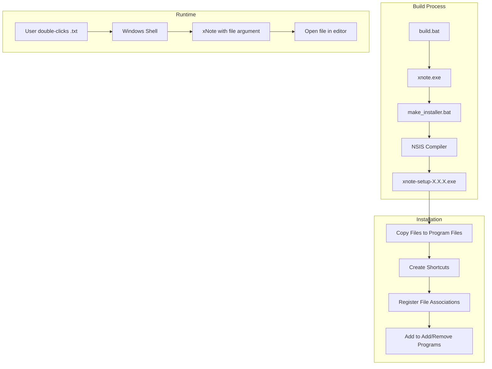

# Design Document: Windows Installer

## Overview

Dokumen ini menjelaskan desain untuk membuat Windows Installer untuk xNote menggunakan NSIS (Nullsoft Scriptable Install System). Installer akan memungkinkan pengguna menginstal xNote dengan mudah, mendaftarkan file associations, dan menjadikan xNote sebagai aplikasi default untuk file teks.

## Architecture



## Components and Interfaces

### 1. NSIS Installer Script (installer/xnote.nsi)

Script NSIS yang mendefinisikan:
- Informasi produk (nama, versi, publisher)
- Direktori instalasi default
- File yang akan diinstal
- Registry entries untuk file associations
- Shortcut creation
- Uninstaller

### 2. Command Line Argument Handler (src/main.c)

Modifikasi pada WinMain untuk:
- Parse command line arguments
- Membuka file yang diberikan sebagai argument
- Handle error untuk file yang tidak valid

### 3. Build Script (installer/make_installer.bat)

Script batch untuk:
- Compile xNote jika belum ada
- Menjalankan NSIS compiler
- Generate installer dengan version number

## Data Models

### Registry Structure

```
HKEY_CLASSES_ROOT
├── .txt
│   └── (Default) = "xNote.TextFile"
├── .log
│   └── (Default) = "xNote.TextFile"
├── xNote.TextFile
│   ├── (Default) = "Text File"
│   ├── DefaultIcon
│   │   └── (Default) = "C:\Program Files\xNote\xnote.exe,0"
│   └── shell
│       └── open
│           └── command
│               └── (Default) = "\"C:\Program Files\xNote\xnote.exe\" \"%1\""
└── Applications
    └── xnote.exe
        └── shell
            └── open
                └── command
                    └── (Default) = "\"C:\Program Files\xNote\xnote.exe\" \"%1\""

HKEY_LOCAL_MACHINE\SOFTWARE\Microsoft\Windows\CurrentVersion\Uninstall\xNote
├── DisplayName = "xNote"
├── DisplayVersion = "1.0.0"
├── Publisher = "xNote Team"
├── UninstallString = "C:\Program Files\xNote\uninstall.exe"
├── InstallLocation = "C:\Program Files\xNote"
└── DisplayIcon = "C:\Program Files\xNote\xnote.exe,0"
```

### File Extensions to Register

| Extension | Description |
|-----------|-------------|
| .txt | Plain Text File |
| .log | Log File |
| .ini | Configuration File |
| .cfg | Configuration File |
| .md | Markdown File |
| .json | JSON File |
| .xml | XML File |
| .html | HTML File |
| .css | CSS File |
| .js | JavaScript File |
| .c | C Source File |
| .h | C Header File |
| .py | Python File |

## Correctness Properties

*A property is a characteristic or behavior that should hold true across all valid executions of a system-essentially, a formal statement about what the system should do. Properties serve as the bridge between human-readable specifications and machine-verifiable correctness guarantees.*

### Property 1: Command line file opening
*For any* valid file path passed as command line argument, xNote SHALL open that file and display its contents in the editor.
**Validates: Requirements 3.1**

### Property 2: Invalid file path handling
*For any* invalid or non-existent file path passed as command line argument, xNote SHALL display an error message and start with an empty document.
**Validates: Requirements 3.3**

## Error Handling

### Installation Errors

| Error | Handling |
|-------|----------|
| Insufficient permissions | Show UAC prompt, fail gracefully if denied |
| Disk space insufficient | Show error message with required space |
| xNote already running | Prompt user to close xNote |
| Previous installation corrupt | Offer to clean install |

### Command Line Errors

| Error | Handling |
|-------|----------|
| File not found | Show error dialog, start with empty document |
| File access denied | Show error dialog with permission info |
| Invalid path characters | Show error dialog, start with empty document |

## Testing Strategy

### Unit Testing

Unit tests akan fokus pada:
- Command line argument parsing
- File path validation
- Error message generation

### Property-Based Testing

Property-based testing menggunakan framework yang sesuai untuk C (seperti theft atau custom implementation):

1. **Property 1 Test**: Generate random valid file paths, launch xNote with argument, verify file is opened
2. **Property 2 Test**: Generate random invalid paths, verify error handling

### Integration Testing

Integration tests (manual atau automated):
- Install/uninstall cycle verification
- File association verification
- Shortcut creation verification
- Registry entry verification

### Test Framework

Untuk C code, kita akan menggunakan:
- Simple assertion-based unit tests
- Manual integration testing for installer
- Property tests implemented as parameterized test cases
